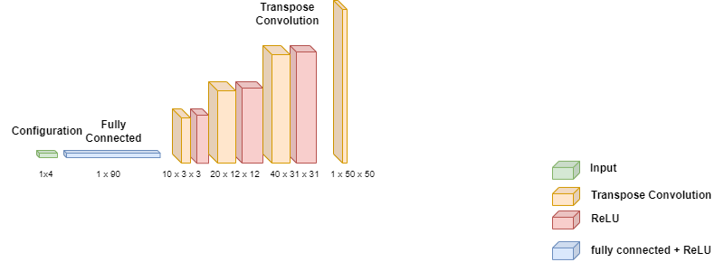

# Description

Open Wave Interference Pipeline is a open ocean wave diffraction simulation pipeline built using the Smoothed Particle Hydrodynamics simulator SPHinXsys. This pipeline is intended to be used for optimization of placements of point absorber deep ocean wave energy generators. This pipeline generates predictions of energy distribution of waves due to the interferences of waves refracting off objects and other generators.

# Collaborators
* Yi Cheng, Zhu
* Zhiyuan, Liu
* Zizheng, Ma
* Kristen, Assad
* Michelle, Bui

# Dependencies

This project is built on the [DualSPHysics](https://dual.sphysics.org/) library.

Binaries for Linux and Windows are provided. OSX is not supported currently.

This project depends on Python. Install requirements using the `requirements.txt` file, i.e. `pip install requirements.txt`.

# Usage

The entire pipeline can be executed using the `pipeline.sh` script.

The pipeline consists of various stages

1. Case Generation (casegen.py)
    * Generate case definitions for simulations.
    * Outputs a Cases.csv file
1. Run Simulations (run_simulations.py)
    * Use the defined cases in Cases.csv to run fluid simulations
1. Process Results (process_results.py)
    * Processes the results generated by the simulations
    * Collects the results into `data.npy` and `labels.npy`
1. Fit Machine Learning Model (fit.py)
    * Use the collected results to fit a machine learning model
    * The model predicts the results of the simulation directly from the configuration
1. Prediction (Omitted From Public Release)
    * Uses the fitted Machine Learning Model to compute the locations for maximum energy output.
    * Accounts for previous buoy locations
    * `Usage: ./predict.py height period dist angle <prev_pos1> <prev_pos2> <prev_pos_row>`
1. Visualization (Omitted From Public Release)
    * Starts a simple Flask server with a html page to visualize the model outputs and the predicted locations

# Objective

The objective of the project is to maximize the power output from an array of wave energy convertors (WECs). This is done by observing the interference pattern created by the first row of WECs and designing a mathematical model for the mooring system to move the WECs in the second row to the areas of constructive interference.

# Model

## Simulation

The goal of the simulations is to determine the ideal formation of the buoys under a given environment. The simulation environment is determined by several key values, specifically wave height, wave period, buoy distance, and buoy angle. These are used to construct simulation cases for the pipeline. 

Simulations were performed by constructing a sufficiently large simulation tank with a steady level of water. The first row of three buoys is simulated for their wave interference effects. Second-row buoys are omitted from the simulation due to the assumption that the buoys on the second row do not impact each other. 

Buoys are constructed in two halves, a "top" half that is static and a "bottom" half that freely floats in the vertical axis along the top half. The top half represents the main body of the generator that is stabilized by the mooring system. The bottom half represents the power generation portion of the buoy. The effects of the energy harvesting by the generator is simulated using a damping spring on the bottom half.

## Energy Generation Estimation
Potential energy generation at a specific location was computed using the standard deviation of water surface height over time. The potential power generation is assumed to be directly proportional to the wave heights. The potential power output map will be estimated as the wave height map. This metric is easily computable via tools in the DualSPHysics software.

Wave surface heights were sampled on a 500m x 500m grid that is fixed with respect to the first row of buoys. Due to the grid being fixed, simulations of different incoming wave angles are done by rotating the buoy array. The sampling is performed with horizontal grid steps of 5m.

Due to rotations of the buoy array in the fixed environment, the sampling grid exceeds the boundaries of the simulation area. The sampling grid is center-cropped to a size of 250m by 250m before post-processing is performed. 

## Machine Learning Model

Due to the finite number of simulations, it is critical to be able to extend the results to configurations without simulations. The task of predicting a full-wave height map is highly complex. Empirically, simple methods such as the closest simulated configuration or linear interpolation performed poorly.

As a result, a Convolutional Neural Network was used as a model. The learning capabilities of deep learning algorithms significantly supersedes the previously mentioned methods. The model takes as input a 4-dimensional vector of wave height, wave period, buoy distance, and buoy angle. It outputs the 50x50 wave height map.

The model consists of one Linear decoding layer and three stacked Transposed Convolution Layers. Between each layer, a non-linear ReLU activation function is used. 

Both the input vector and the output image are normalized as a pre-processing step. The input vector is normalized per element and the output image is normalized together, both to a standard normal distribution.
